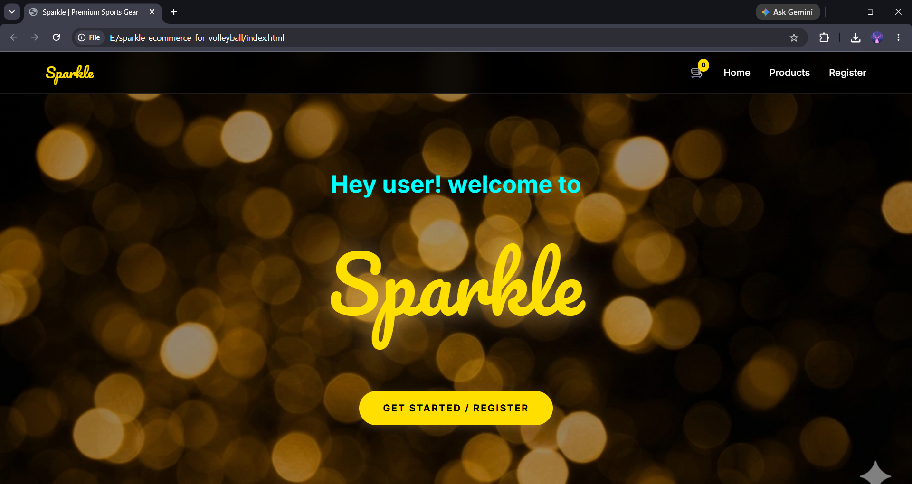
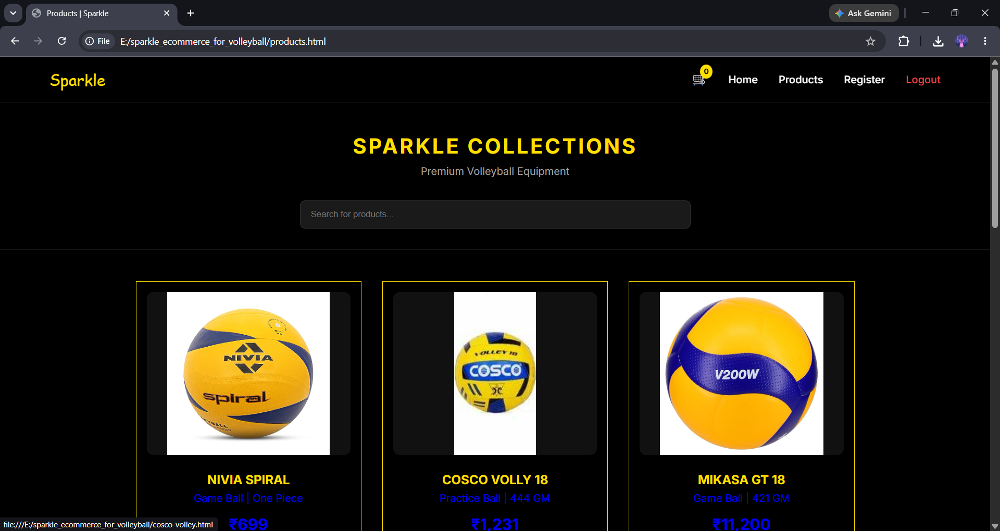
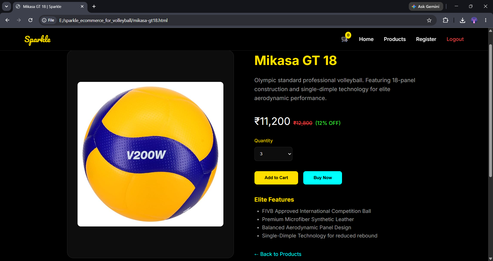

# Sparkle E-Commerce Website

<table align="center">
  <tr>
    <td colspan="2" align="center">
      <strong>Landing Page</strong><br><br>
      
    </td>
  </tr>
  <tr>
    <td align="center" width="50%">
      <strong>Products Catalog</strong><br><br>
      
    </td>
    <td align="center" width="50%">
      <strong>Product Detail (Mikasa GT18)</strong><br><br>
      
    </td>
  </tr>
</table>

## Project preview

Sparkle is a front-end e-commerce website built for premium volleyball products. It includes a landing page, registration flow, product catalog, individual product pages, and a shopping cart experience with client-side persistence.

## How to explore this project

Since this is a static HTML, CSS, and JavaScript project, open it locally using any of the following options:

- **Quick preview:** Open the `screenshots/` folder to view the design and key pages.
- **Open directly:** Launch `index.html` in your browser.
- **Best experience:** Use VS Code Live Server to navigate through the site smoothly.

## What this repository demonstrates

- A clean volleyball-focused e-commerce UI with a premium dark theme
- Client-side registration and access control using `localStorage`
- Product listing pages for multiple volleyball brands and models
- Add-to-cart and remove-from-cart functionality
- Responsive layout and reusable navigation/footer structure
- A simple shopping flow from landing page to cart summary

---

## Website pages

### 1. Home / Landing Page
- Brand introduction with a bold hero section
- Primary navigation to Products and Register
- Minimal, premium first impression for the store

### 2. Registration Page
- User registration form
- Password confirmation check
- Basic validation for contact number
- Successful registration unlocks the protected product pages

### 3. Products Catalog
- Displays the Sparkle volleyball collection
- Lists multiple products with pricing and product highlights
- Search/filter-style browsing experience through product cards

### 4. Product Detail Pages
- Separate pages for featured volleyballs and models
- Product-specific information and add-to-cart actions
- Protected access after registration

### 5. Shopping Cart
- Shows all added items
- Displays running total
- Supports item removal
- Empty-cart state for a clean user experience

---

## Technical highlights

### HTML
- Semantic page structure
- Separate pages for each product and section
- Consistent navigation and footer layout across the site

### CSS
- Premium dark visual theme
- Reusable utility-style classes
- Card layouts, hover effects, and responsive sections
- Custom colors built around the Sparkle brand identity

### JavaScript
- Registration guard for protected pages
- Cart count updates in the navbar
- `localStorage`-based authentication simulation
- Add-to-cart, remove-from-cart, and cart rendering logic

### Data handling
- No backend required
- Cart and registration state are stored in browser `localStorage`
- Fully client-side demo project

---

## Key skills gained

- Building multi-page websites
- Creating reusable UI components with HTML and CSS
- Adding interactivity with JavaScript
- Using `localStorage` for simple persistence
- Designing a complete e-commerce user flow
- Organizing project files for clean navigation

---

## Repo structure

```bash
sparkle_ecommerce_for_volleyball/
│
├── cart.html
├── cosco-volley.html
├── index.html
├── jj-jonex.html
├── mikasa-gt18.html
├── nivia-g2020.html
├── nivia-spiral.html
├── products.html
├── register.html
├── senston-spansyon.html
├── vector-x.html
│
├── css/
│   └── styles.css
│
├── js/
│   └── auth.js
│
├── images/
│   ├── background.png
│   ├── cosco_vollyball_18.jpg
│   ├── jj_jonex.jpg
│   ├── mikasa_gt_18.jpg
│   ├── nivia_spiral.jpg
│   ├── senston.jpg
│   └── vector x.jpg
│
└── screenshots/
    ├── 01-landing-page.png
    ├── 02-registration-page.png
    ├── 03-products-catalog.png
    ├── 04-product-detail-mikasa-gt18.png
    ├── 05-product-detail-vector-x.png
    ├── 06-product-detail-senston-spansyon.png
    ├── 07-product-detail-nivia-spiral.png
    ├── 08-footer-section.png
    ├── 09-cart-with-items.png
    ├── 10-cart-empty-state.png
    ├── 11-auth-guard-redirect.png
    ├── 12-products-search-active.png
    └── 13-products-catalog-scrolled.png
```

---

## Tools used

- HTML5
- CSS3
- JavaScript
- Browser `localStorage`
- VS Code / Live Server

---

## What’s next

- Add a backend with real user accounts
- Store cart items in a database
- Add product search and filtering with better sorting
- Make the checkout flow fully functional
- Connect the site to an admin panel for product management

---

## About the project

**Sparkle** is a premium volleyball sports gear store built as a front-end project for practice, portfolio presentation, and web development learning.

---

## About the author

**Rushit Tholiya**
